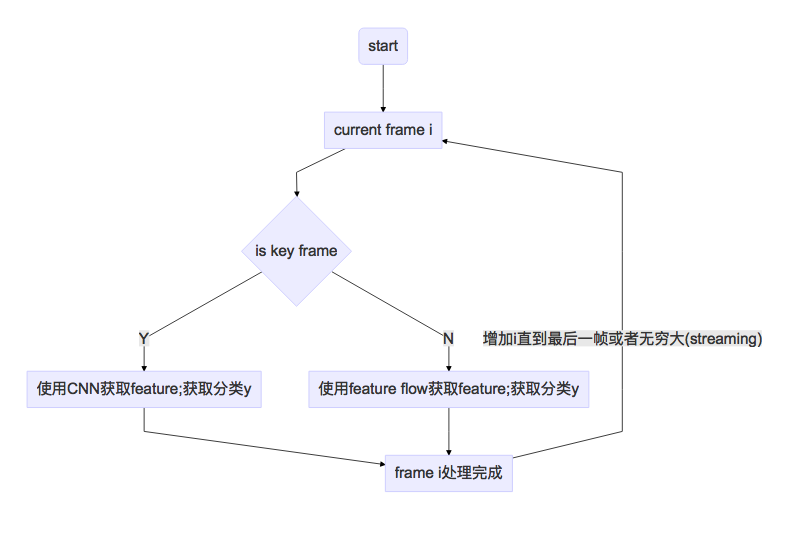

##  Deep Feature Flow for Video Recognition

https://arxiv.org/pdf/1611.07715.pdf

### 要点

1. 使用key frame+feature flow解决逐帧处理的计算要求并不太损失精确度
2. 算法非常简单，具体见下面的流程图

### 个人点评

1. 之前我在处理video recognition时主要是通过跳过n帧来减小计算，但是也会出现错误跳过的情况

### 讨论

### Resources

1. source code(official in MXNet): https://github.com/msracver/Deep-Feature-Flow
2. 
